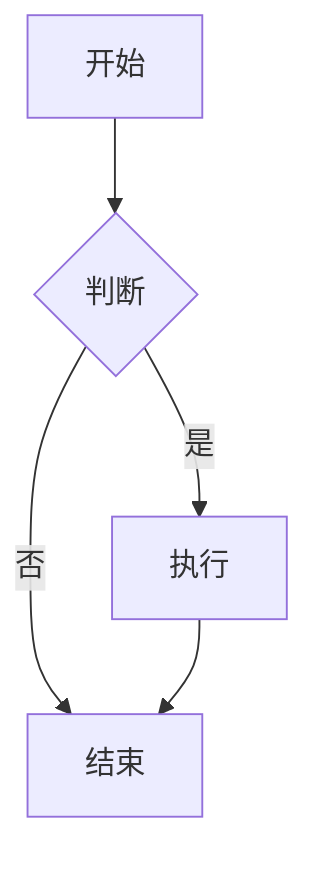

# Markdown 语法

Markdown 是一种轻量级标记语言，用于格式化文本。它简单易学，广泛应用于文档编写、博客、论坛等。

## 基础语法

### 标题

```markdown
# 一级标题
## 二级标题
### 三级标题
#### 四级标题
##### 五级标题
###### 六级标题
```

### 强调

```markdown
*斜体* 或 _斜体_
**粗体** 或 __粗体__
***粗斜体*** 或 ___粗斜体___
~~删除线~~
```

效果：*斜体*、**粗体**、***粗斜体***、~~删除线~~

### 列表

#### 无序列表

```markdown
- 项目1
- 项目2
  - 子项目2.1
  - 子项目2.2
- 项目3

* 也可以用星号
+ 或者加号
```

#### 有序列表

```markdown
1. 第一项
2. 第二项
3. 第三项
   1. 子项3.1
   2. 子项3.2
```

### 链接

```markdown
[链接文本](https://example.com)
[带标题的链接](https://example.com "鼠标悬停显示")

# 自动链接
<https://example.com>
<email@example.com>

# 引用式链接
[链接文本][ref]
[ref]: https://example.com
```

### 图片

```markdown


# 图片链接
[](https://example.com)
```

### 引用

```markdown
> 这是一段引用
> 可以有多行

> 多级引用
>> 第二级
>>> 第三级
```

### 代码

#### 行内代码

```markdown
使用 `反引号` 包裹代码
```

#### 代码块

````markdown
```python
def hello():
    print("Hello World")
```

```javascript
console.log("Hello World");
```
````

### 分割线

```markdown
---
***
___
```

---

### 表格

```markdown
| 左对齐 | 居中 | 右对齐 |
|:-------|:----:|-------:|
| 内容1  | 内容2 | 内容3 |
| 内容4  | 内容5 | 内容6 |
```

| 左对齐 | 居中 | 右对齐 |
|:-------|:----:|-------:|
| 内容1  | 内容2 | 内容3 |

### 任务列表

```markdown
- [x] 已完成任务
- [ ] 未完成任务
- [ ] 另一个任务
```

- [x] 已完成任务
- [ ] 未完成任务

### 脚注

```markdown
这是一段文字[^1]

[^1]: 这是脚注内容
```

## Github Flavored Markdown (GFM)

GitHub 对 Markdown 进行了扩展，增加了一些特性。

### 语法高亮

````markdown
```python
def hello():
    print("Hello")
```
````

### 表情符号

```markdown
:smile: :heart: :+1: :rocket:
```

:smile: :heart: :+1: :rocket:

[表情符号列表](https://github.com/ikatyang/emoji-cheat-sheet)

### @提及和#引用

```markdown
@username
#123
```

### 自动链接

GitHub 会自动将 URL 转为链接：
```markdown
https://github.com
```

### Diff 代码块

````markdown
```diff
- 删除的行
+ 添加的行
```
````

### 折叠内容

```markdown
<details>
<summary>点击展开</summary>

这里是隐藏的内容

</details>
```

### Alert 警告框（GitHub新特性）

```markdown
> [!NOTE]
> 有用的信息，用户应该知道。

> [!TIP]
> 帮助用户更成功的建议。

> [!IMPORTANT]
> 用户成功的关键信息。

> [!WARNING]
> 需要用户立即注意的紧急信息。

> [!CAUTION]
> 行动的负面潜在后果。
```

### 数学公式

使用 LaTeX 语法：

```markdown
行内公式：$E = mc^2$

块级公式：
$$
\sum_{i=1}^{n} i = \frac{n(n+1)}{2}
$$
```

### Mermaid 图表

````markdown

````

## 高级技巧

### HTML 嵌入

Markdown 支持直接使用 HTML：

```markdown
<div align="center">
  
</div>

<kbd>Ctrl</kbd> + <kbd>C</kbd>

<mark>高亮文本</mark>
```

### 字符转义

使用反斜杠转义特殊字符：

```markdown
\* 不是斜体
\# 不是标题
\[ 不是链接
```

### 锚点链接

```markdown
[跳转到标题](#标题名称)

# 中文标题会被转为拼音或其他形式
```

### 徽章 Badge

```markdown


```

### 目录生成

```markdown
[TOC]

# 某些编辑器支持自动生成目录
```

## 常用工具

- **编辑器**：Typora, VS Code, Obsidian
- **在线编辑**：StackEdit, Dillinger
- **格式化**：Prettier, markdownlint
- **转换**：Pandoc (Markdown to PDF/Word/HTML)

## 最佳实践

1. **保持简洁**：Markdown 的优势在于简单
2. **使用标题**：合理的层级结构
3. **代码高亮**：指定语言提升可读性
4. **图片优化**：控制图片大小
5. **预览检查**：编写后及时预览效果
6. **版本控制**：Markdown 适合 Git 管理
7. **链接检查**：确保链接有效

## 参考资源

- [Markdown 官方教程](https://www.markdownguide.org/)
- [GitHub Markdown 文档](https://docs.github.com/zh/get-started/writing-on-github)
- [CommonMark 规范](https://commonmark.org/)
- [Markdown Cheatsheet](https://github.com/adam-p/markdown-here/wiki/Markdown-Cheatsheet)